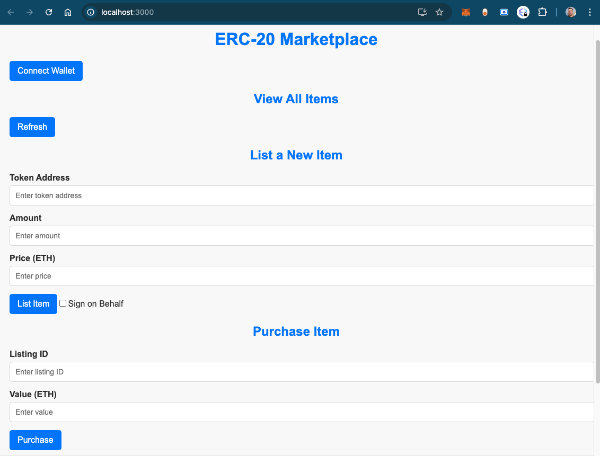
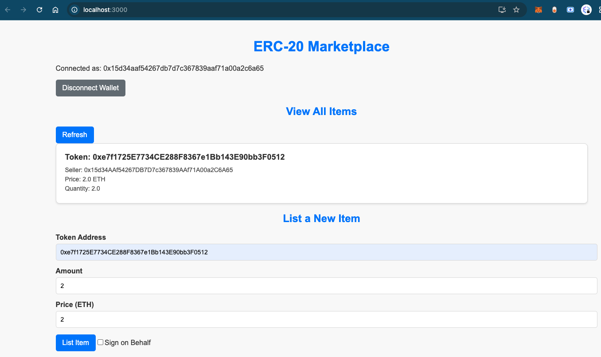
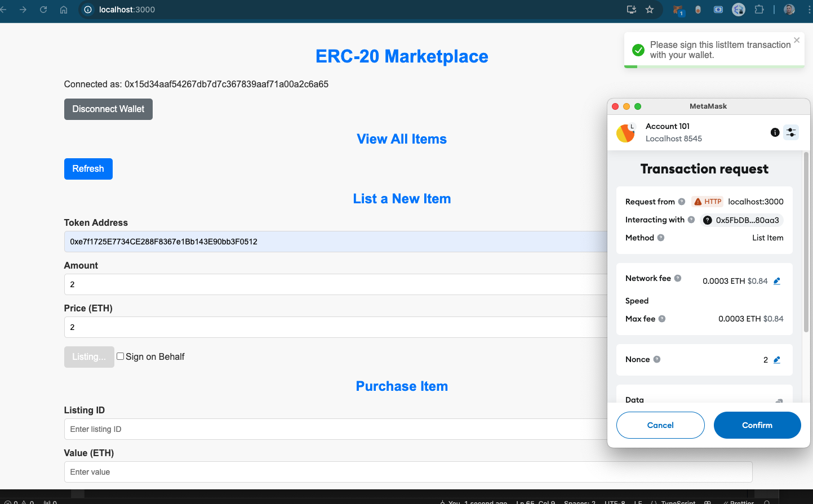

#  Marketplace Frontend

This project is a frontend implementation of an Ethereum-based marketplace. It interacts with smart contracts deployed on Ethereum (or local Ganache network) and integrates with MetaMask for transaction signing.

## Features

- **MetaMask Integration**: Connects to MetaMask for handling Ethereum transactions.
- **Item Listing**: Displays marketplace items with details like token, price, and quantity.
- **Transaction Handling**: Allows users to sign and send transactions to the Ethereum network.
- **Responsive Design**: Built with React and styled components for a modern and responsive UI.

## Screenshots





---

## Getting Started

### Prerequisites

- **Node.js**: Install the latest version of [Node.js](https://nodejs.org/).
- **MetaMask**: Install the MetaMask browser extension from [metamask.io](https://metamask.io/).
- **Ganache (Optional)**: For local Ethereum development, install [Ganache](https://trufflesuite.com/ganache/).

---

## Installation ##

```bash
git clone <repository-url>
cd marketplace-frontend
npm install --force
```

## Create a .env file in the project root: ##

MARKETPLACE_ADDRESS=0xYourContractAddress

## Start ##

```bash
npm run start
```